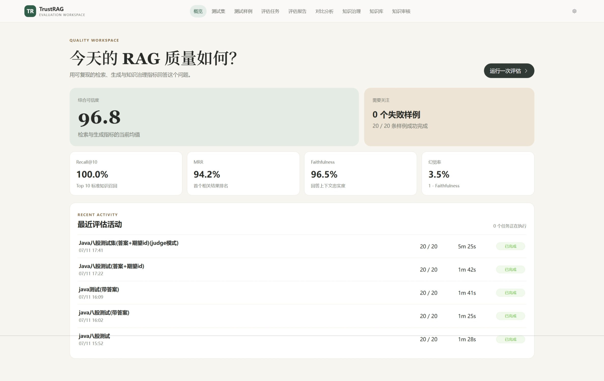
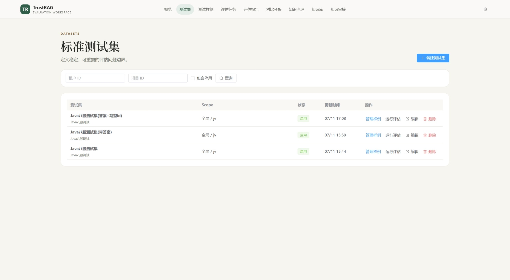
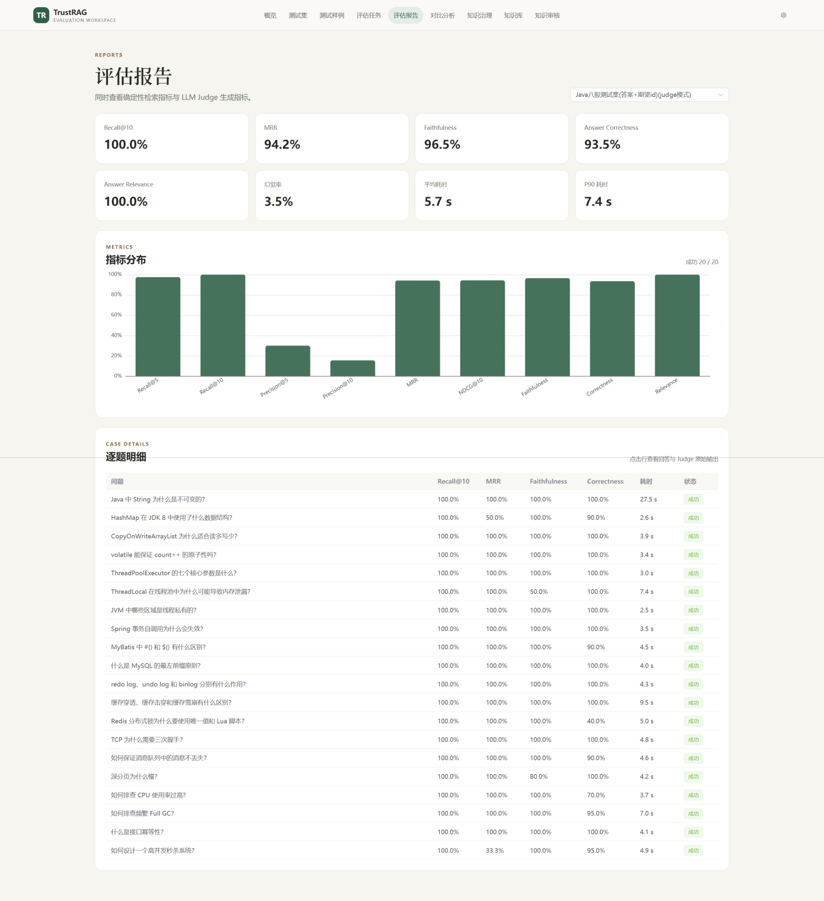
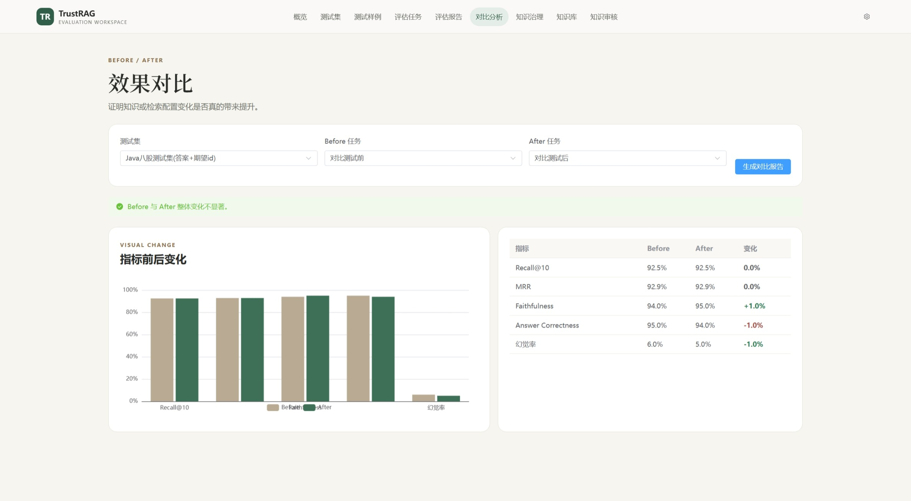
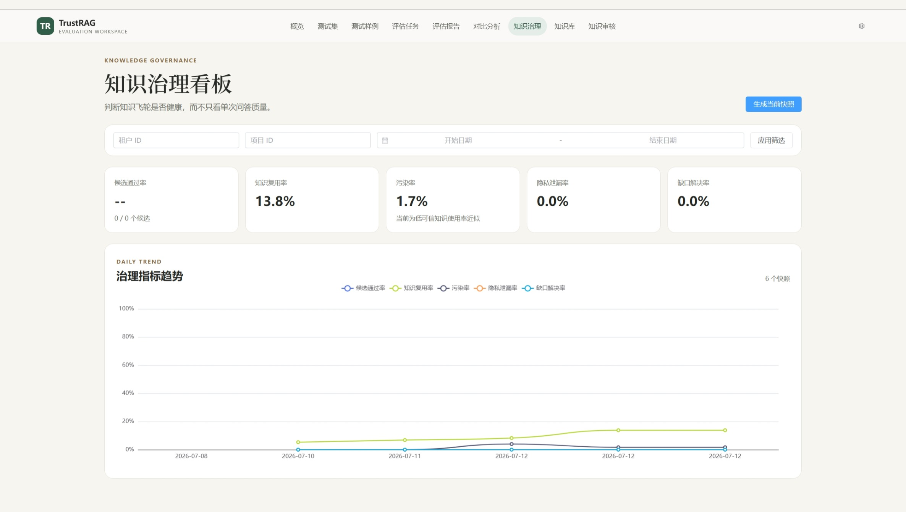
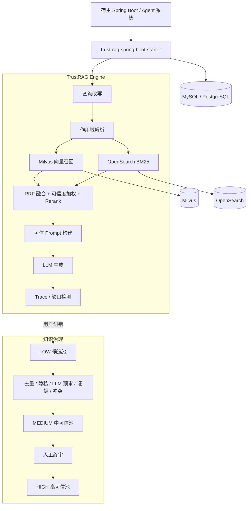

# TrustRAG · 可信自进化 RAG 框架

> 面向 Spring Boot 的可信 RAG 基础框架：以 **混合检索、知识分级、反馈回流、自动晋升、人工终审和可复现评测**，控制知识如何进入、使用、升级、降级与退出。

<p align="center">
  
  
  
  
  
  
  
  
</p>

<p align="center">
  <a href="./docs/screenshots/概览界面.jpeg">
    
  </a>
  <br>
  <sub>▲ TrustRAG Evaluation Workspace：检索、生成与知识治理指标概览</sub>
</p>

<p align="center">
  <a href="#快速开始">快速开始</a> ·
  <a href="#接入宿主项目">Starter 接入</a> ·
  <a href="#系统架构">系统架构</a> ·
  <a href="#api-速览">API 速览</a> ·
  <a href="#效果图">效果图</a> ·
  <a href="./docs/screenshots/">截图目录</a>
</p>

---

## 目录

- [项目介绍](#项目介绍)
- [项目作用](#项目作用)
- [核心能力](#核心能力)
- [效果图](#效果图)
- [系统架构](#系统架构)
- [技术栈](#技术栈)
- [目录结构](#目录结构)
- [快速开始](#快速开始)
- [构建并安装 Starter](#构建并安装-starter)
- [接入宿主项目](#接入宿主项目)
- [关键配置](#关键配置)
- [模型配置](#模型配置)
- [调用框架能力](#调用框架能力)
- [启动评估管理台](#启动评估管理台)
- [API 速览](#api-速览)
- [测试与构建](#测试与构建)
- [常见问题](#常见问题)
- [详细文档](#详细文档)
- [许可协议](#许可协议)

---

## 项目介绍

TrustRAG 是一个可被业务系统直接引入的 **Spring Boot Starter**，不是需要单独部署的聊天应用。

宿主项目提供数据库、模型和 Embedding 能力后，即可注入：

- `TrustRagEngine`：执行可信 RAG 问答。
- `KnowledgeIngestionService`：导入高、中、低可信知识。
- `TrustRagFeedbackService`：接收点赞、点踩与用户纠错。
- `KnowledgeReviewService`：处理人工审核与高可信晋升。
- 评估与管理 API：管理测试集、运行评估、生成报告并观察知识治理指标。

TrustRAG 不会把模型回答直接写回知识库。只有用户纠错、人工提交或可信文档导入才能产生候选知识；候选知识必须经过自动治理和人工终审，才能成为全局高可信知识。

## 项目作用

传统 RAG 往往只解决“能否检索到内容”，TrustRAG 更关注以下问题：

| 问题 | TrustRAG 的处理方式 |
| --- | --- |
| 错误知识是否会污染知识库 | 模型回答不直接入库；用户纠错进入低可信候选池 |
| 不同来源的知识是否同等可信 | 按 HIGH / MEDIUM / LOW 分级，并参与可信度加权 |
| 私有知识是否会越权召回 | 支持会话、用户、项目、租户和全局作用域隔离 |
| 向量检索漏召回关键词怎么办 | Milvus 向量检索 + OpenSearch BM25 + RRF 融合 |
| 单个检索引擎故障怎么办 | 自动降级为单路召回；双路失败进入无上下文保守回答 |
| 新知识如何变成可信知识 | 去重、隐私、LLM 预审、证据、冲突、评分、人工终审 |
| 如何证明 RAG 修改有效 | 测试集、检索指标、LLM Judge、Before/After 对比 |
| 如何接入已有业务系统 | Starter 自动配置 + SPI 扩展点 + 可替换存储和模型 |

## 核心能力

- **可信三池治理**：低、中、高三类知识池，覆盖候选、晋升、审批、降级、过期、冲突、合并和回滚。
- **知识反馈飞轮**：用户纠错形成低可信候选，经自动治理进入中池，再由人工终审进入高池。
- **混合检索**：Milvus 向量召回与 OpenSearch BM25 并行执行，以 RRF、可信度权重和可选 Rerank 完成排序。
- **作用域隔离**：低可信知识按 conversation / user / project / tenant 精确控制可见范围。
- **文档导入**：支持 PDF、Word、HTML、Markdown、Wiki、Tika 兜底解析和受控 Git 文档源。
- **一致性与补偿**：关系库作为状态权威源，配合乐观锁、任务原子领取、双索引补偿和知识血缘记录。
- **可复现评测**：支持 Recall@K、Precision@K、MRR、NDCG、Faithfulness、Correctness、Relevance、幻觉率和 P90 延迟。
- **Starter 工程化接入**：通过 Spring Boot 自动配置适配 Spring AI，并允许使用自定义 Bean 覆盖默认实现。

## 效果图

> 截图中的指标来自特定演示测试集，用于展示评估流程和界面能力，不代表通用模型基准。

**快速导航：**

[概览界面](./docs/screenshots/概览界面.jpeg) ·
[测试集](./docs/screenshots/测试集.jpeg) ·
[测试样例](./docs/screenshots/测试样例.jpeg) ·
[评估任务](./docs/screenshots/评估任务.jpeg) ·
[评估报告](./docs/screenshots/评估报告.jpeg) ·
[对比分析](./docs/screenshots/对比分析.jpeg) ·
[知识治理看板](./docs/screenshots/知识治理看板.jpeg) ·
[知识库管理](./docs/screenshots/知识库管理.jpeg) ·
[知识审核](./docs/screenshots/知识审核.jpeg)

<table>
  <tr>
    <td width="50%" align="center">
      <a href="./docs/screenshots/测试集.jpeg"></a><br>
      <b>测试集管理</b>
    </td>
    <td width="50%" align="center">
      <a href="./docs/screenshots/评估报告.jpeg"></a><br>
      <b>检索与生成评估报告</b>
    </td>
  </tr>
  <tr>
    <td width="50%" align="center">
      <a href="./docs/screenshots/对比分析.jpeg"></a><br>
      <b>Before / After 效果对比</b>
    </td>
    <td width="50%" align="center">
      <a href="./docs/screenshots/知识治理看板.jpeg"></a><br>
      <b>知识治理指标趋势</b>
    </td>
  </tr>
</table>

其余完整截图可在 [docs/screenshots](./docs/screenshots/) 中查看。

## 系统架构



一次问答的默认路径：

```text
RagRequest
  → QueryRewriteService
  → ScopeResolver
  → Milvus + OpenSearch 并行召回
  → RRF(k=60) 融合
  → 关系库状态与作用域二次校验
  → 可信度加权与可选 Rerank
  → PromptBuilder
  → LlmClient
  → RagTrace + KnowledgeGapDetector
  → RagAnswer
```

## 技术栈

| 层次 | 技术 |
| --- | --- |
| 核心语言 | Java 17（JDK 21 推荐用于开发） |
| 基础框架 | Spring Boot 3.5.15、Spring AI 1.1.5、Spring JDBC |
| 关系数据库 | MySQL 8.4（默认）、PostgreSQL |
| 向量检索 | Milvus 2.6、Milvus Java SDK 2.6.18 |
| 关键词检索 | OpenSearch 2.19、BM25 |
| 数据迁移 | Flyway，MySQL / PostgreSQL 双方言基线 |
| 文档解析 | Apache Tika、PDFBox、Apache POI、Jsoup、Flexmark、JGit |
| 评估管理台 | Vue 3、TypeScript、Vite、Element Plus、ECharts、Pinia |
| 测试 | JUnit 5、AssertJ、Spring Boot Test、Vitest、MSW |
| 构建 | Maven 3.9、pnpm 11 |

## 目录结构

```text
TrustRAG/
├── trust-rag-core/                 # 领域模型、可信检索、问答引擎、三池治理
├── trust-rag-milvus/               # Milvus 向量存储与服务端过滤
├── trust-rag-opensearch/           # OpenSearch BM25、索引与权限过滤
├── trust-rag-document/             # 文档上传、解析、切分和 Git 文档源
├── trust-rag-evaluation/           # 测试集、指标、LLM Judge、对比报告
├── trust-rag-storage-jdbc/         # MySQL/PostgreSQL 仓储与 Flyway 基线
├── trust-rag-admin-api/            # 知识治理、文档和评估 HTTP API
├── trust-rag-spring-boot-starter/  # 自动配置、Spring AI 适配、调度任务
├── trust-rag-example-springboot/   # H2 演示与真实中间件接入示例
├── trust-rag-admin-ui/             # Vue 3 评估与知识治理管理台
├── trust-rag-docs/                 # 架构、配置、API、Starter 接入文档
├── docs/screenshots/               # README 展示截图
├── docker-compose.yml              # MySQL、Milvus、OpenSearch 等本地基础设施
└── pom.xml                         # Maven 多模块父工程
```

## 快速开始

### 1. 环境要求

| 依赖 | 建议版本 | 检查命令 |
| --- | --- | --- |
| JDK | 17 或 21 | `java -version` |
| Maven | 3.9+ | `mvn -version` |
| Docker | 支持 Compose v2 | `docker compose version` |
| Node.js | 22.12+（启动管理台时需要） | `node -v` |
| Corepack / pnpm | pnpm 11.8.0 | `corepack pnpm -v` |

### 2. 下载项目

```powershell
git clone https://github.com/yinyouq/TrustRAG.git
cd TrustRAG
```

也可以在 GitHub 页面选择 **Code → Download ZIP**，解压后进入项目根目录。

### 3. 启动本地基础设施

```powershell
Copy-Item .env.example .env
docker compose up -d
docker compose ps
```

Compose 会启动 MySQL、Milvus、OpenSearch、etcd、MinIO，以及用于容器内存采集的 cAdvisor 和 Prometheus，**不会启动 TrustRAG 本身**。TrustRAG 是框架，由宿主 Java 应用通过 Starter 引入。

默认本地连接：

| 服务 | 地址 | 用途 |
| --- | --- | --- |
| MySQL | `localhost:3306` | 知识、Trace、反馈、治理任务、评估数据 |
| Milvus | `http://localhost:19530` | 向量存储与召回 |
| OpenSearch | `http://localhost:9200` | BM25 关键词检索 |
| Prometheus | `http://localhost:9090` | Milvus + OpenSearch 容器内存指标 |
| cAdvisor | `http://localhost:8081` | Docker 容器资源采集 |

停止基础设施：

```powershell
docker compose down
```

### 基础设施运行内存

评估管理台的“基础设施运行内存”页面只聚合 Milvus 和 OpenSearch 的容器
Working Set、RSS 及所选时间窗口内的 Working Set 峰值；宿主 Java、MySQL、
etcd、MinIO、Embedding 与 LLM 服务均不计入该指标。Compose 已提供 cAdvisor
采集和 Prometheus 存储，使用 `milvus` profile 启动示例应用时会自动读取
`http://localhost:9090`。

接入其他宿主项目时，按部署环境配置 Prometheus 地址即可：

```yaml
trust-rag:
  admin-api:
    enabled: true
  infrastructure-memory:
    enabled: true
    prometheus-url: http://prometheus:9090 # 宿主进程在本机时使用 http://localhost:9090
    default-window-minutes: 60
    max-window-minutes: 1440
```

默认按 cAdvisor 的 Docker Compose 标签
`container_label_com_docker_compose_service` 过滤名称为 `milvus` 和
`opensearch` 的容器。非 Compose 或 Kubernetes 部署可用
`service-label`、`milvus-service`、`opensearch-service` 覆盖此约定。

### Flyway 迁移兼容性

TrustRAG 的版本化迁移不可改写。已发布的 `V1__trust_rag_schema.sql`
保持为初始基线，后续结构演进统一放在 `V2__...` 及更高版本中。升级已有
TrustRAG 数据库时，不要执行 `flyway repair` 来绕过校验和；应升级到包含对应
前向迁移的 TrustRAG 版本，让 Flyway 自动继续执行新的版本。

## 构建并安装 Starter

### 1. 完整验证

```powershell
mvn -s maven-settings.xml clean verify
```

### 2. 打包为 JAR

```powershell
mvn -s maven-settings.xml clean package -DskipTests
```

各模块的 JAR 会生成到对应模块的 `target/` 目录，例如：

```text
trust-rag-core/target/trust-rag-core-1.0.0-SNAPSHOT.jar
trust-rag-spring-boot-starter/target/trust-rag-spring-boot-starter-1.0.0-SNAPSHOT.jar
```

### 3. 安装到本地 Maven 仓库

仅执行 `package` 不会让另一个项目自动找到 Starter。要在本机其他项目中直接引用，需要执行：

```powershell
mvn -s maven-settings.xml clean install
```

安装成功后，`io.github.trustrag:trust-rag-spring-boot-starter:1.0.0-SNAPSHOT` 会进入本地 Maven 仓库。

## 接入宿主项目

在你的 Spring Boot / Agent 项目中加入：

```xml
<dependencies>
    <dependency>
        <groupId>io.github.trustrag</groupId>
        <artifactId>trust-rag-spring-boot-starter</artifactId>
        <version>1.0.0-SNAPSHOT</version>
    </dependency>

    <dependency>
        <groupId>org.springframework.boot</groupId>
        <artifactId>spring-boot-starter-web</artifactId>
    </dependency>

    <dependency>
        <groupId>com.mysql</groupId>
        <artifactId>mysql-connector-j</artifactId>
        <scope>runtime</scope>
    </dependency>

    <!-- 示例使用 Spring AI OpenAI Provider；也可以换成其他 Provider 或自定义 SPI -->
    <dependency>
        <groupId>org.springframework.ai</groupId>
        <artifactId>spring-ai-starter-model-openai</artifactId>
        <version>1.1.5</version>
    </dependency>
</dependencies>
```

Starter 会传递引入 Core、Milvus、OpenSearch、Document、Evaluation、JDBC Storage 和 Admin API，但具体模型 Provider 由宿主项目选择。

## 关键配置

以下配置使用仓库默认的 MySQL + Milvus + OpenSearch：

```yaml
spring:
  datasource:
    url: jdbc:mysql://localhost:3306/trust_rag?useUnicode=true&characterEncoding=UTF-8&serverTimezone=Asia/Shanghai&allowPublicKeyRetrieval=true&useSSL=false
    username: trust_rag
    password: ${MYSQL_PASSWORD:trust_rag}
    driver-class-name: com.mysql.cj.jdbc.Driver
  flyway:
    enabled: true
    locations: classpath:db/mysql
  servlet:
    multipart:
      max-file-size: 50MB
      max-request-size: 50MB

trust-rag:
  enabled: true
  admin-api:
    enabled: true

  milvus:
    enabled: true
    uri: http://localhost:19530
    database: default
    collection: trust_rag_knowledge_vector
    dimension: 1536
    metric-type: COSINE
    # AUTOINDEX（默认）；可选 FLAT、IVF_FLAT、IVF_SQ8、IVF_PQ、
    # HNSW、HNSW_SQ、HNSW_PQ、HNSW_PRQ、DISKANN、SCANN、IVF_RABITQ。
    # FLAT 适合精确基线与小数据集；IVF 系列适合较大数据集；HNSW 系列以更多内存换低延迟；
    # DISKANN 适合超大规模数据。改此项仅影响新建 Collection，已有 Collection 需重建索引。
    index-type: AUTOINDEX
    vector-top-k: 30
    auto-create-collection: true

  opensearch:
    enabled: true
    uris:
      - http://localhost:9200
    index-name: trust_rag_knowledge_keyword
    keyword-top-k: 30
    auto-create-index: true

  retrieval:
    mode: hybrid-rrf
    prompt-top-k: 5
    fusion-top-n: 30
    min-vector-score: 0.60

  rrf:
    enabled: true
    k: 60

  trace:
    save-prompt: false
```

> `trust-rag.milvus.dimension` 必须与 Embedding 模型输出维度完全一致。修改 Embedding 模型或维度后，应重建 Collection 或使用新的 Collection。

## 模型配置

TrustRAG 至少需要两种模型能力：

| 能力 | Spring AI Bean / TrustRAG SPI | 用途 |
| --- | --- | --- |
| 文本生成 | `ChatModel` 或 `LlmClient` | 最终回答、查询改写、候选预审和冲突判断 |
| 文本向量 | `EmbeddingModel` 或 `EmbeddingClient` | 知识入库与查询向量化 |

### 方式一：使用 Spring AI 自动配置

```yaml
spring:
  ai:
    openai:
      api-key: ${OPENAI_API_KEY}
      chat:
        options:
          model: gpt-4o-mini
      embedding:
        options:
          model: text-embedding-3-small
          dimensions: 1536
```

启动前通过环境变量提供密钥，不要把真实 Key 提交到 Git：

```powershell
$env:OPENAI_API_KEY="your-api-key"
```

当 Spring 容器中存在 `ChatModel` 和 `EmbeddingModel` 时，Starter 会自动适配为 TrustRAG 的 `LlmClient` 和 `EmbeddingClient`。

如果 Chat 与 Embedding 使用不同厂商，可分别配置对应的 Spring AI Provider，或使用下面的 SPI 方式。

### 方式二：接入已有模型封装

```java
@Configuration
class TrustRagModelConfiguration {

    @Bean
    LlmClient trustRagLlmClient(YourChatService chatService) {
        return prompt -> new LlmResponse(
                chatService.generate(prompt),
                0.80,
                TokenUsage.unknown());
    }

    @Bean
    EmbeddingClient trustRagEmbeddingClient(YourEmbeddingService embeddingService) {
        return new EmbeddingClient() {
            @Override
            public List<Float> embed(String text) {
                return embeddingService.embed(text);
            }

            @Override
            public String modelName() {
                return "your-embedding-model";
            }

            @Override
            public int dimension() {
                return 1536;
            }
        };
    }
}
```

自定义 Bean 会覆盖 Starter 默认适配，适合已经封装 Qwen、OpenAI、Ollama 或企业模型网关的项目。

## 调用框架能力

### 1. 执行可信问答

```java
@Service
public class AgentRagService {

    private final TrustRagEngine trustRagEngine;

    public AgentRagService(TrustRagEngine trustRagEngine) {
        this.trustRagEngine = trustRagEngine;
    }

    public RagAnswer ask(
            String question,
            String userId,
            String conversationId,
            String projectId,
            String tenantId) {
        return trustRagEngine.ask(RagRequest.builder()
                .question(question)
                .userId(userId)
                .conversationId(conversationId)
                .projectId(projectId)
                .tenantId(tenantId)
                .build());
    }
}
```

### 2. 导入高可信知识

```java
@Service
public class AgentKnowledgeService {

    private final KnowledgeIngestionService ingestionService;

    public AgentKnowledgeService(KnowledgeIngestionService ingestionService) {
        this.ingestionService = ingestionService;
    }

    public KnowledgeImportResult importOfficialDoc(
            String title,
            String content,
            String sourceRef) {
        return ingestionService.importKnowledge(new KnowledgeImportRequest(
                title,
                content,
                "official_doc",
                sourceRef,
                TrustLevel.HIGH,
                ScopeType.GLOBAL,
                null,
                null,
                null,
                null));
    }
}
```

### 3. 接收用户纠错

```java
feedbackService.submitFeedback(new RagFeedbackRequest(
        traceId,
        FeedbackType.CORRECTION,
        "原回答不准确",
        correctedAnswer,
        userId,
        conversationId,
        projectId,
        tenantId));
```

`CORRECTION` 必须提供 `correctedAnswer`。纠错会创建低可信候选，并进入后续治理与晋升流程。

完整代码示例见 [Starter 接入指南](./trust-rag-docs/src/main/resources/docs/starter-integration.md)。

## 启动评估管理台

评估管理台是可选组件。连接真实后端前，需要在宿主应用启用：

```yaml
trust-rag:
  enabled: true
  admin-api:
    enabled: true
```

然后启动前端：

```powershell
cd trust-rag-admin-ui
corepack enable
corepack pnpm install --frozen-lockfile
Copy-Item .env.example .env
corepack pnpm dev
```

浏览器访问 Vite 输出的地址，默认通常为 <http://localhost:5173>。开发代理默认连接 <http://localhost:8080>，可在 `.env` 中调整：

```dotenv
VITE_PROXY_TARGET=http://localhost:8080
VITE_API_BASE_URL=/trust-rag/admin/eval
VITE_USE_MOCKS=false
```

不启动后端也可以体验 UI：

```powershell
$env:VITE_USE_MOCKS="true"
corepack pnpm dev
```

前端验证与生产构建：

```powershell
corepack pnpm typecheck
corepack pnpm test:run
corepack pnpm build
```

## API 速览

管理 API 仅在 `trust-rag.admin-api.enabled=true` 且宿主应用为 Servlet Web 应用时注册。

| 方法 | 路径 | 说明 |
| --- | --- | --- |
| `POST` | `/trust-rag/feedback` | 提交点赞、点踩或纠错反馈 |
| `POST` | `/api/documents/upload` | 异步上传并导入文档 |
| `GET` | `/api/documents/tasks/{taskId}` | 查询文档导入任务 |
| `POST` | `/api/documents/git` | 从受控 Git 文档源导入 |
| `POST` | `/trust-rag/admin/knowledge/import` | 导入高、中、低可信知识 |
| `GET` | `/trust-rag/admin/knowledge` | 按信任级别和状态查询知识 |
| `POST` | `/trust-rag/admin/promotion/run` | 手动执行一批晋升任务 |
| `GET` | `/trust-rag/admin/promotion/tasks` | 查询晋升任务与失败原因 |
| `POST` | `/trust-rag/admin/knowledge/{id}/approve-high` | 人工终审并晋升高可信 |
| `POST` | `/trust-rag/admin/knowledge/{id}/downgrade` | 知识降级 |
| `POST` | `/trust-rag/admin/knowledge/{id}/rollback` | 知识回滚 |
| `GET/POST` | `/trust-rag/admin/eval/datasets` | 管理评估测试集 |
| `GET/POST` | `/trust-rag/admin/eval/cases` | 管理测试样例 |
| `POST` | `/trust-rag/admin/eval/runs` | 创建评估任务 |
| `GET` | `/trust-rag/admin/eval/runs/{id}/report` | 获取评估报告 |
| `POST` | `/trust-rag/admin/eval/compare` | 生成 Before/After 对比 |

问答接口由宿主应用自行定义；[示例项目](./trust-rag-example-springboot/src/main/java/io/github/trustrag/example/ChatController.java) 提供 `POST /api/chat`。

完整请求体和响应说明见 [API 文档](./trust-rag-docs/src/main/resources/docs/api.md)。

## 测试与构建

```powershell
# 后端完整验证
mvn -s maven-settings.xml clean verify

# 前端测试与构建
cd trust-rag-admin-ui
corepack pnpm install --frozen-lockfile
corepack pnpm test:run
corepack pnpm build
```

后端测试覆盖可信检索、混合检索降级、RRF、知识晋升、生命周期、索引补偿、文档解析、评估指标、JDBC 仓储以及完整知识飞轮集成流程。

## 常见问题

### 1. 找不到 Starter 依赖

```text
Could not find artifact io.github.trustrag:trust-rag-spring-boot-starter
```

请先在 TrustRAG 根目录执行 `mvn -s maven-settings.xml clean install`。如果使用了自定义 Maven 本地仓库，宿主项目构建时也必须使用同一个仓库。

### 2. 没有 `TrustRagEngine` Bean

依次检查：

- 是否设置 `trust-rag.enabled=true`。
- 是否提供 `DataSource`。
- 是否存在 `ChatModel` / `LlmClient`。
- 是否存在 `EmbeddingModel` / `EmbeddingClient`。
- Milvus、OpenSearch 配置是否与实际服务一致。

### 3. Embedding dimension mismatch

`EmbeddingClient.dimension()`、Embedding 模型输出维度和 `trust-rag.milvus.dimension` 必须相同。Collection 已按旧维度创建时，需要删除重建或更换 Collection 名称。

### 4. MySQL 启动后没有表

确认：

```yaml
spring:
  flyway:
    enabled: true
    locations: classpath:db/mysql
```

同时确认宿主项目中存在 MySQL 驱动，并连接到了 Compose 创建的 `trust_rag` 数据库。

### 5. 执行 `docker compose up -d` 后没有 API

这是正常行为。Compose 只启动框架依赖的基础设施；TrustRAG 是 Starter，需要由你的宿主 Spring Boot 应用引入并启动。

### 6. 管理台请求 404 或无法连接

- 后端必须启用 `trust-rag.admin-api.enabled=true`。
- 检查 `VITE_PROXY_TARGET` 是否指向宿主应用。
- 生产环境需要将 `/trust-rag/**` 转发给宿主后端。

## 详细文档

- [系统架构](./trust-rag-docs/src/main/resources/docs/architecture.md)
- [配置参考](./trust-rag-docs/src/main/resources/docs/configuration.md)
- [Starter 外部项目接入指南](./trust-rag-docs/src/main/resources/docs/starter-integration.md)
- [HTTP API 文档](./trust-rag-docs/src/main/resources/docs/api.md)
- [评估管理台说明](./trust-rag-admin-ui/README.md)
- [全部效果图](./docs/screenshots/)

## 安全说明

- 不要把真实模型 API Key、数据库密码或私有仓库凭据提交到 Git。
- 生产环境应通过环境变量或密钥管理系统注入敏感配置。
- `trust-rag.admin-api.enabled` 默认关闭；生产环境必须由宿主应用或网关提供认证和 RBAC。
- 完整 Prompt 默认不持久化；启用前应评估隐私和合规风险。
- 远程 Git 文档导入默认关闭，启用后必须配置允许的主机列表。

## 许可协议

本项目基于 [MIT License](./LICENSE) 开源。

---

> TrustRAG 的目标不是让模型“记住更多内容”，而是让系统能够解释：**这条知识从哪里来、谁可以使用、为什么可信、如何被验证，以及何时应该退出。**
